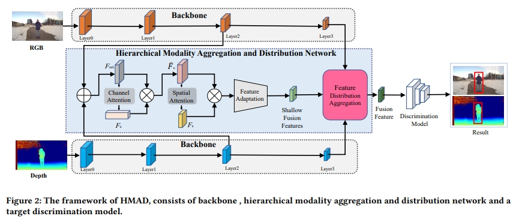
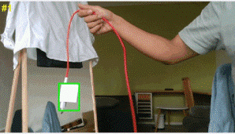
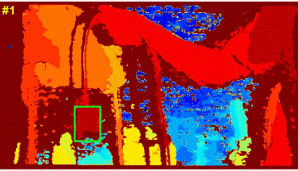

# RGB-D Tracking via Hierarchical Modality Aggregation and Distribution Network( Proceedings of ACM International Conference on Multimedia in Asia (MMAsia'23))
This is the results of the MMAsia2023 paper "MTNet: RGB-D Tracking via Hierarchical Modality Aggregation and Distribution Network( Proceedings of ACM International Conference on Multimedia in Asia".


The integration of dual-modal features has been pivotal in advancing RGB-Depth (RGB-D) tracking. However, current trackers are less efficient and focus solely on single-level features, resulting in weaker robustness in fusion and slower speeds that fail to meet the demands of real-world applications. In this paper, we introduce a novel network, denoted as HMAD (Hierarchical Modality Aggregation and Distribution), which addresses these challenges. HMAD leverages the distinct feature representation strengths of RGB and depth modalities, giving prominence to a hierarchical approach for feature distribution and fusion, thereby enhancing the robust ness of RGB-D tracking. Experimental results on various RGB-D datasets demonstrate that HMAD achieves state-of-the-art performance. Moreover, real-world experiments further validate HMAD`s capacity to effectively handle a spectrum of tracking challenges in real-time scenarios.
<div align="center">
   
</div>

## 🌟Depth-track results
You can download the raw result depthtrack-result.zip

**PR:0.626 SR:0.597**
## 🌟RGBD-1K results
You can download the raw result rgbd1kres.zip

**PR:0.573 SR:0.552**

## Citation
Please cite this paper in your publications if it helps your research:

```
@inproceedings{xu2023rgb,
  title={RGB-D Tracking via Hierarchical Modality Aggregation and Distribution Network},
  author={Xu, Boyue and Xu, Yi and Hou, Ruichao and Bei, Jia and Ren, Tongwei and Wu, Gangshan},
  booktitle={Proceedings of the 5th ACM International Conference on Multimedia in Asia},
  pages={1--7},
  year={2023}
}

```

